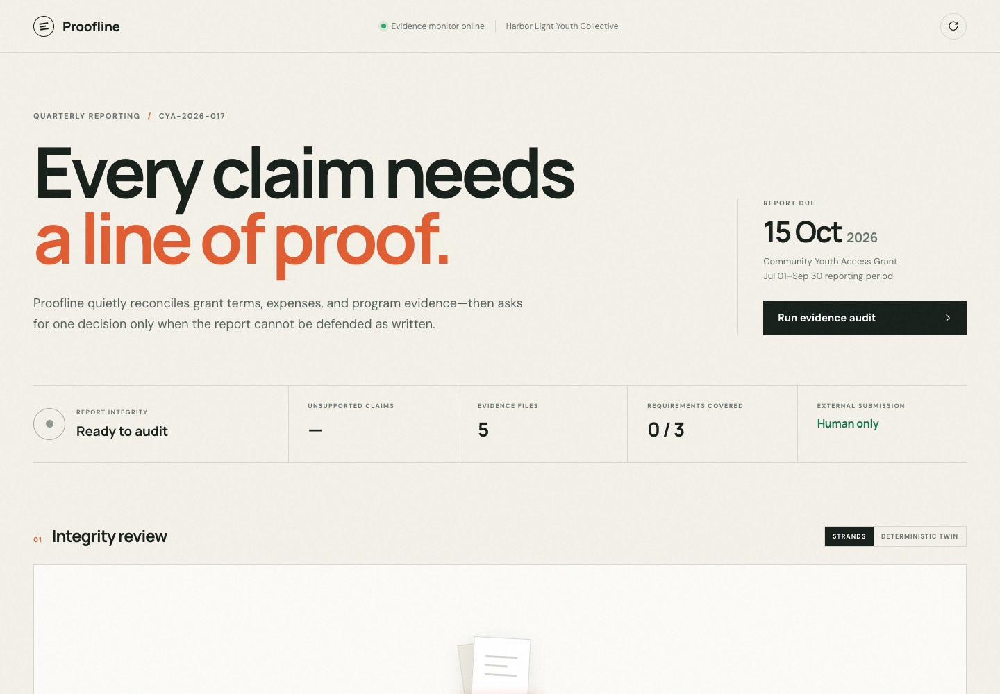
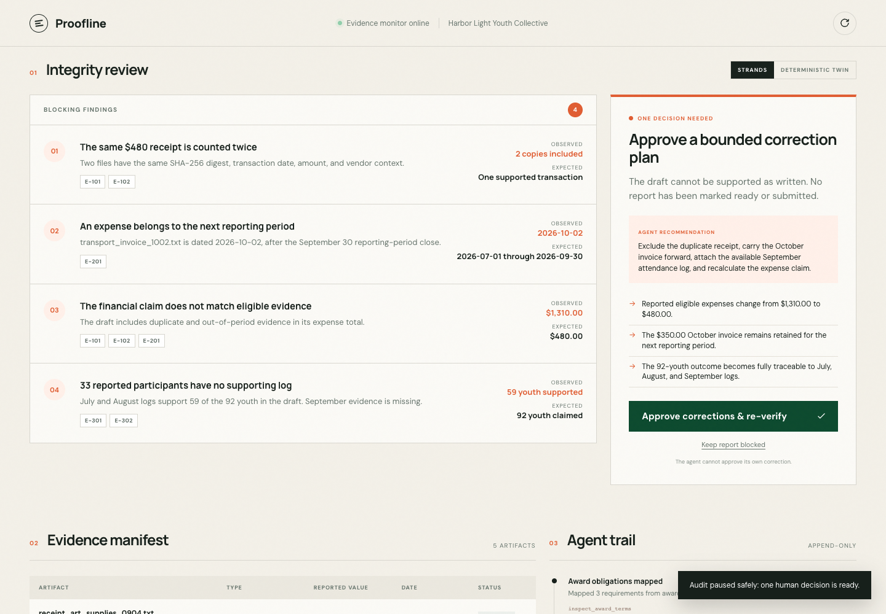
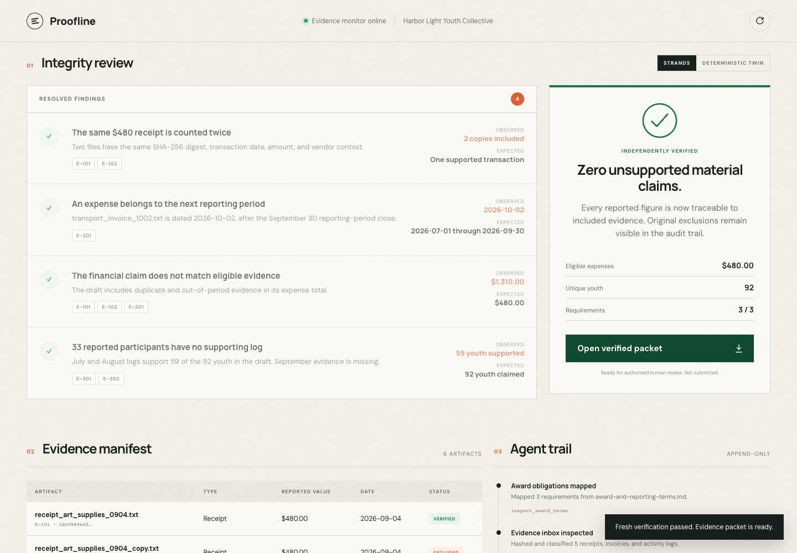
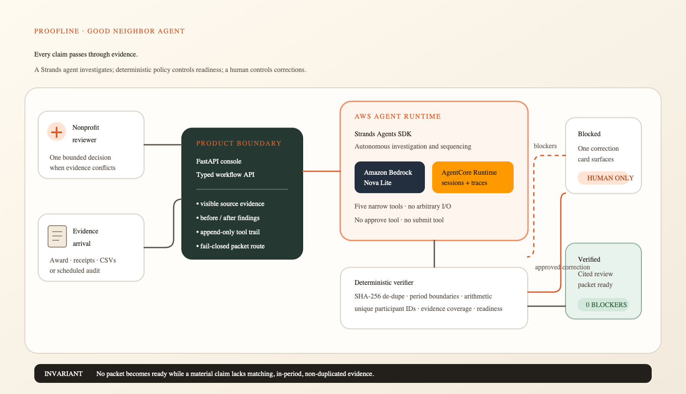
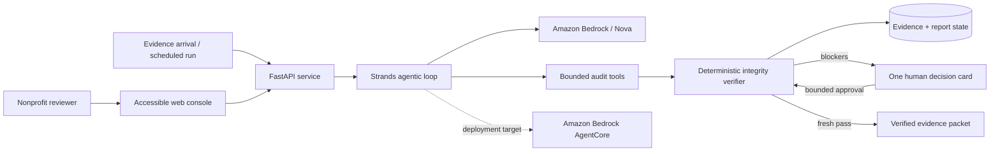

# Proofline

**Every grant-report claim, traced before submission.**

**[Open the live Proofline demo](https://ckmt39zrrm.us-west-2.awsapprunner.com/)**


Proofline is a background grant-report integrity agent for small nonprofits. It maps award
obligations, reconciles receipts and program logs, catches unsupported or duplicated claims,
and surfaces one bounded human decision. A report packet is produced only after independent
verification passes.

> **Agents for Humans track:** Good Neighbor Agents  
> **Privacy:** every organization, award, receipt, and participant ID in the demo is synthetic.  
> **Authority:** Proofline never submits a report or approves its own correction.

## The problem

Small nonprofit teams must prove both how grant money was spent and what their programs
accomplished. The evidence often lives across award documents, spreadsheets, receipts, and
program logs.

- [GAO reports](https://www.gao.gov/products/gao-23-106797) that burdensome grant-management
  requirements consume recipient capacity and can make programs less cost effective.
- In a focused [GAO nonprofit study](https://www.gao.gov/products/gao-10-477), more than half of
  participating nonprofits said administrative reporting made their grants challenging to manage;
  three said administrative cost deterred them from seeking or renewing government grants.
- [Grants.gov](https://www.grants.gov/learn-grants/grants-101/post-award-phase) calls post-award
  implementation, reporting, and closeout a significant continuing workload, with requirements
  and schedules that vary by grant.
- A [recent nonprofit staff account](https://www.reddit.com/r/nonprofit/comments/1tzu2oz/grant_management/)
  describes a quarterly report containing a duplicated receipt and an expense for an activity
  that had not yet occurred—the exact class of failure used in this demo.

Most grant AI projects help organizations **find or write** grants. Proofline starts after the
award and asks a narrower question: _can every material claim in this report be defended by the
evidence?_ It is an integrity gate, not a prose generator.

## One complete workflow

The included scenario follows a fictional youth nonprofit preparing one quarterly report:

1. A report draft and five evidence artifacts arrive.
2. A Strands agent inspects the award and evidence inbox.
3. Deterministic checks discover four blockers:
   - the same USD 480 receipt was uploaded twice;
   - a USD 350 invoice falls outside the reporting period;
   - the USD 1,310 financial claim does not reconcile to unique, in-period evidence;
   - only 59 of 92 reported youth have a supporting attendance log.
4. Proofline consolidates the blockers into one correction decision.
5. The authorized reviewer approves the exact changes.
6. Proofline adds the pending September log, excludes—but retains—the duplicate and future-period
   invoice, recalculates the financial claim, and reruns every check from source state.
7. A report packet becomes available with **zero unsupported material claims**.

The original evidence and complete append-only tool trail remain visible throughout.

## Product walkthrough

### 1. A quiet, judge-ready starting point



### 2. Four linked failures become one bounded decision



### 3. Human approval triggers a fresh, independent verification pass



## Why this needs an agent

Grant language and evidence are heterogeneous. The Strands loop handles the judgment-heavy work:

- decide which source or tool to inspect next;
- interpret award obligations in context;
- investigate contradictions across records;
- continue silently when the report is supportable;
- consolidate related failures into one useful human decision;
- resume the workflow after that decision.

The model is deliberately not the final authority. Hash equality, reporting-period boundaries,
unique-participant counts, arithmetic, evidence coverage, packet readiness, and submission
authority are enforced in ordinary Python.

## Run locally

Requirements: Python 3.12+ and [uv](https://docs.astral.sh/uv/).

```bash
uv sync
uv run uvicorn proofline.main:app --reload
```

Open <http://127.0.0.1:8000> and select **Run evidence audit**.

The default deterministic mode is a faithful, reproducible product twin used for public demos
and automated tests. To run the same audit through a live Strands agent backed by Amazon Bedrock:

```bash
export PROOFLINE_AGENT_MODE=strands
export AWS_PROFILE=your-profile
export AWS_REGION=us-west-2
export BEDROCK_MODEL_ID=us.amazon.nova-lite-v1:0
uv run uvicorn proofline.main:app --reload
```

After deploying the included AgentCore runtime, the console can call the managed runtime directly:

```bash
export PROOFLINE_AGENT_MODE=agentcore
export AGENTCORE_RUNTIME_ARN=arn:aws:bedrock-agentcore:REGION:ACCOUNT:runtime/NAME
export AGENTCORE_REGION=us-west-1  # when the runtime is in a different region
uv run uvicorn proofline.main:app --reload
```

The AWS profile name is only a local convenience. No credentials or account identifiers are
committed.

## Verify the claims

```bash
uv run pytest -q
uv run ruff check .
uv run python scripts/evaluate.py
```

The evaluation covers dirty, partially repaired, clean, and human-approved workflows. It asserts
that all four seeded error classes are found, clean evidence verifies, blocked evidence never
emits a packet, and no scenario performs an external submission.

## Architecture





See [docs/architecture.md](docs/architecture.md) for trust boundaries and component detail.

## Strands implementation

[`src/proofline/strands_agent.py`](src/proofline/strands_agent.py) constructs a real
`strands.Agent` with five narrow tools:

1. `inspect_award_terms`
2. `inspect_evidence_inbox`
3. `run_deterministic_integrity_checks`
4. `prepare_human_decision`
5. `verify_packet_permission`

The agent has no external-submission tool and no tool that can approve the pending correction.
Human approval enters through a separate application endpoint and is bound to decision
`DEC-001`. Packet rendering fails closed unless the latest deterministic status is `verified`.

## AgentCore deployment

The repository includes a validated Amazon Bedrock AgentCore Runtime definition and a dedicated
entry point at [`src/proofline/agentcore_app.py`](src/proofline/agentcore_app.py). Each runtime
invocation creates an isolated scenario store, launches the same five-tool Strands audit, and
returns its typed findings and bounded decision. AgentCore provides the managed execution surface;
the web console remains the human authorization surface.

```bash
export PATH="/opt/homebrew/opt/node/bin:$PATH"  # only if Homebrew Node is not already first
export AWS_PROFILE=your-profile
export AWS_REGION=us-west-1
agentcore validate -d .
agentcore package -d . -r ProoflineAgent
agentcore deploy -y
agentcore invoke --runtime ProoflineAgent \
  "Audit CYA-2026-017 and stop at the first authorized human decision."
```

AgentCore CLI requires Node.js 20 or later and AWS CDK. The deployment configuration lives in
[`agentcore/agentcore.json`](agentcore/agentcore.json); local target/account state and deployment
archives are not committed.

## Synthetic evidence fixtures

The source artifacts are checked into
[`src/proofline/fixtures`](src/proofline/fixtures). Application hashes are calculated from those
real bytes at runtime. Attendance counts are computed from de-identified IDs in the CSV fixtures
rather than trusting a model-generated total.

The award language is a synthetic fixture informed by public Grants.gov guidance; it is not a
real government award. This keeps the demo legally shareable and deterministic while exercising
the actual workflow.

## API

| Method | Path | Purpose |
|---|---|---|
| `GET` | `/api/health` | Runtime, model, and authority-boundary disclosure |
| `GET` | `/api/state` | Current award, evidence, findings, decisions, and audit trail |
| `POST` | `/api/audits/CYA-2026-017/run` | Start the deterministic or live Strands audit |
| `POST` | `/api/audits/CYA-2026-017/resolve` | Record the exact human decision and re-verify |
| `GET` | `/api/reports/CYA-2026-017/packet` | Render only a verified review packet |
| `POST` | `/api/reset` | Restore the reproducible judge scenario |

## Repository map

```text
src/proofline/
  main.py              FastAPI web/API entry point and Lambda adapter
  strands_agent.py     live Strands + Bedrock loop and bounded tools
  verifier.py          deterministic integrity authority
  workflow.py          reproducible product twin and human-resolution flow
  packet.py            fail-closed evidence packet renderer
  models.py            typed workflow contracts
  store.py             synthetic scenario state and fixture ingestion
  fixtures/            actual hashed demo artifacts
  static/              responsive judge-facing product UI
scripts/evaluate.py    evidence-backed scenario evaluation
tests/                 API, policy, drift, and golden-path tests
docs/                  architecture and submission material
deployment/            AWS deployment artifacts
```

## Responsible scope

- Proofline supports report preparation; it is not legal, accounting, or audit advice.
- It does not determine whether a cost is legally allowable beyond explicit encoded terms.
- It does not contact funders or submit reports.
- A `verified` result means the demonstrated material claims reconcile to supplied evidence under
  the configured policy. It does not certify fraud absence or regulatory compliance.
- Production use would require organization-specific access control, retention, accounting-system
  integrations, and grant-officer review.

## Hackathon disclosure

Proofline was newly created during the Agents for Humans Hackathon submission period. Standard
open-source libraries, public documentation, web research, and AI coding assistance were used.
No pre-existing application code is presented as Proofline work. An earlier internal food-rescue
scaffold was retired before this implementation and is not included in the final source tree.

## License

[MIT](LICENSE) © 2026 kermit
