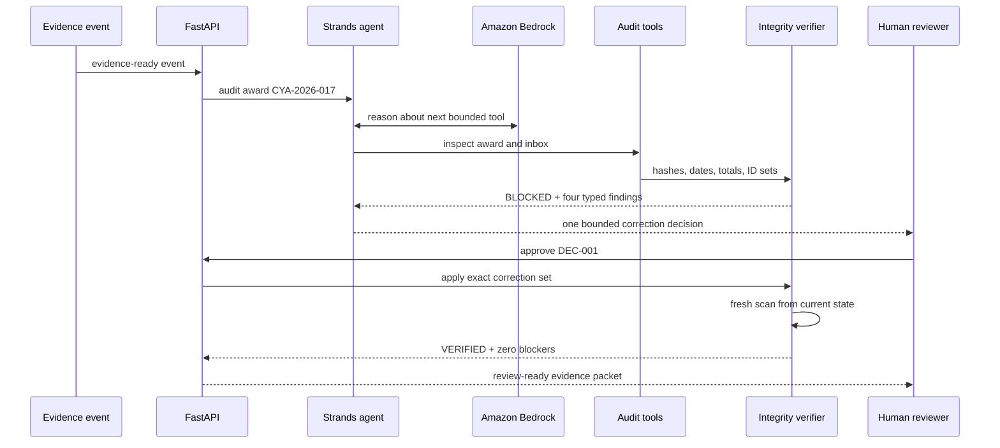

# Proofline architecture and trust boundaries

## Product invariant

> Proofline must not mark a grant-report packet ready while any material claim lacks matching,
> in-period, non-duplicated evidence under the configured award policy.

The model can interpret and propose. It cannot grant readiness, approve a correction, change a
source file, or submit a report.

## Runtime flow

## Components

| Component | Responsibility | Cannot do |
|---|---|---|
| Web console | Explain evidence, findings, decision, and before/after state | Grant authority to the model |
| FastAPI | Typed HTTP workflow and state-transition boundary | Emit a blocked packet |
| Strands agent | Interpret obligations, select tools, sequence investigation, produce a concise brief | Approve corrections or submit externally |
| Amazon Bedrock | Model inference for the live loop | Override tool results |
| Audit tools | Narrow, observable access to award, evidence, and verifier operations | Perform arbitrary filesystem or network actions |
| Integrity verifier | Hash de-duplication, period checks, arithmetic, unique-ID coverage, readiness | Interpret ambiguous policy without an encoded rule |
| Human decision endpoint | Bind approval or rejection to a concrete decision ID | Create open-ended authority |
| Packet renderer | Produce a cited review artifact after `verified` state | Render while blockers exist |

## Failure behavior

- Duplicate upload: both artifacts stay visible; one must be explicitly excluded.
- Outside-period invoice: retained for future reporting, excluded from this claim.
- Unsupported outcome: the report stays blocked until supporting IDs arrive or the claim changes.
- Rejected correction: no evidence or claim mutation occurs.
- Evidence drift: a new scan recomputes support and reopens the report when counts diverge.
- Model error or prompt injection: deterministic readiness checks still fail closed.
- AWS unavailable: the deterministic twin demonstrates the same state machine without claiming a
  live model invocation.

## AWS path

The application is designed for a small, reviewable AWS footprint:

- Amazon Bedrock provides model inference.
- Amazon Bedrock AgentCore is the target managed runtime for the Strands agent.
- Amazon S3 is the production evidence-arrival boundary.
- Amazon EventBridge can schedule deadline checks or react to normalized intake events.
- Amazon DynamoDB can persist report state and idempotency keys.
- AWS App Runner or Lambda can host the judge-facing web console.

Only services actually deployed and evidenced should be claimed in the final submission.
